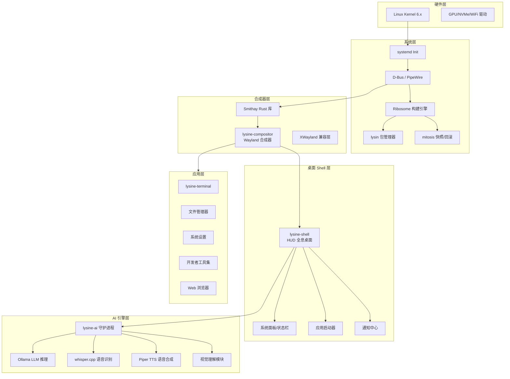
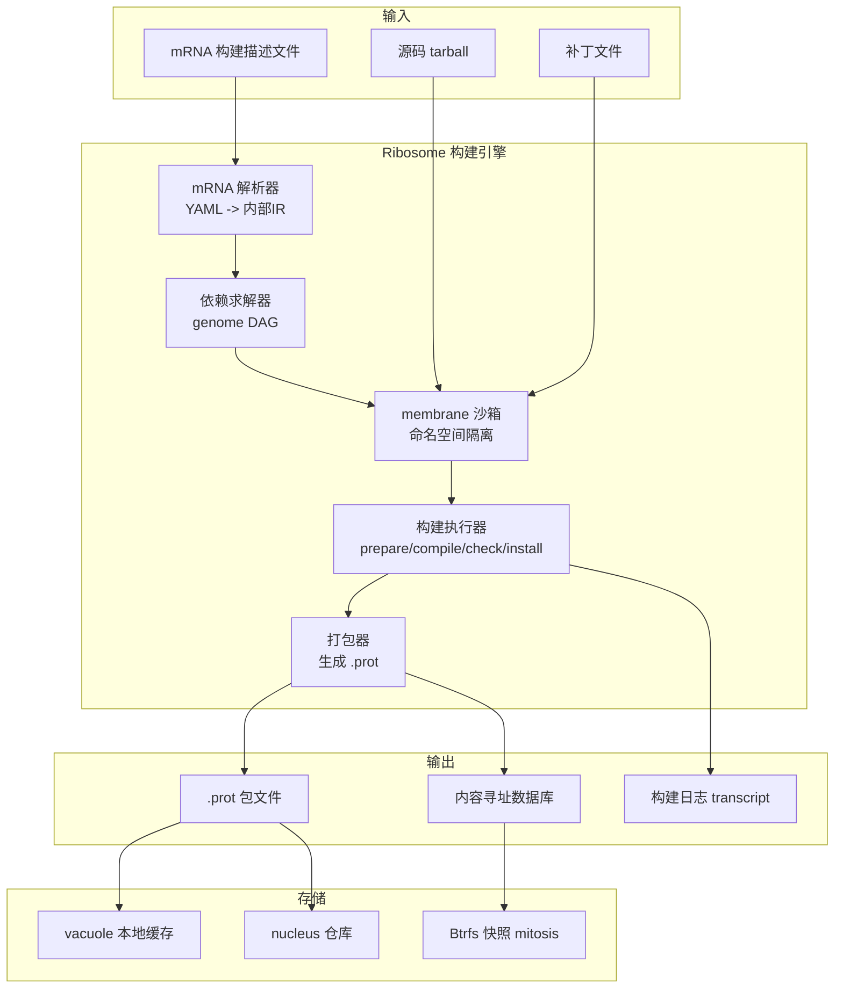
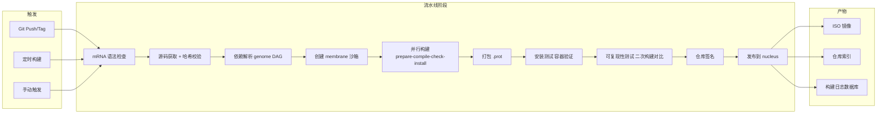

# LysineOS - 操作系统总体架构方案

## 项目愿景

构建一个面向开发者的 AI 原生 Linux 操作系统，核心特征：

- **从零构建**：基于 LFS 13.0（systemd），完整控制从内核到桌面的每一层
- **Ribosome 构建系统**：自研构建引擎（ribosome）+ 包管理器（lysin）+ 生物学隐喻命名体系
- **JARVIS 式 UI**：HUD 全息风格界面，弧形反应堆动画、波形可视化、透明磨砂面板
- **AI 深度集成**：语音唤醒、对话、视觉理解，本地优先 + 云端可选
- **开发者友好**：内置容器支持、多语言工具链、tiling 窗口管理

---

## 系统整体架构




---

## 一、Ribosome 构建系统

### 1.1 命名体系

在生物学中：**Lysine（赖氨酸）** 是蛋白质的基本氨基酸构建块，**Ribosome（核糖体）** 是读取 mRNA 指令、将氨基酸组装成蛋白质的分子机器。

对应到 LysineOS：**LysineOS** = 由无数"氨基酸"（软件包）组成的"蛋白质"（操作系统），**Ribosome** = 读取构建指令、将源码组装成系统的构建引擎，**mRNA** = 构建描述文件。

整套构建系统的组件命名遵循生物学隐喻：


| 组件       | 名称             | 生物学含义    | 系统含义       |
| -------- | -------------- | -------- | ---------- |
| 构建引擎     | **ribosome**   | 核糖体      | 核心构建守护进程   |
| 构建描述文件   | **mRNA**       | 信使RNA    | 包的构建配方     |
| 包管理器 CLI | **lysin**      | 赖氨酸的化学简称 | 安装/卸载/查询包  |
| 二进制包格式   | **.prot**       | 蛋白质      | 编译好的包文件    |
| 包仓库      | **nucleus**    | 细胞核      | 软件仓库服务器    |
| 沙箱隔离     | **membrane**   | 细胞膜      | 构建沙箱隔离层    |
| 依赖图      | **genome**     | 基因组      | 所有包的依赖关系图谱 |
| 系统快照     | **mitosis**    | 有丝分裂     | 系统状态的快照/回滚 |
| 构建日志     | **transcript** | 转录产物     | 构建过程的完整日志  |
| 本地包缓存    | **vacuole**    | 液泡       | 本地源码/二进制缓存 |


### 1.2 mRNA 构建描述文件

mRNA 是 Ribosome 的核心，采用声明式 YAML + 可选脚本：

```yaml
# example: nucleus/core/gcc/14.2.0.mRNA
api-version: 1
name: gcc
version: 14.2.0
release: 1

description: GNU Compiler Collection
homepage: https://gcc.gnu.org/
license: GPL-3.0-or-later

depends:
  build:
    - binutils >= 2.42
    - glibc >= 2.39
    - gmp >= 6.3
    - mpfr >= 4.2
    - mpc >= 1.3
  runtime:
    - glibc >= 2.39
    - binutils >= 2.42

features:
  default: [cxx, fortran, objc, ada]
  options:
    dlang:
      description: D language support
      depends: [gdc]
    go:
      description: Go language support
    lto:
      description: Link-time optimization support
      cflags: -flto=auto

sources:
  - url: https://ftp.gnu.org/gnu/gcc/gcc-14.2.0/gcc-14.2.0.tar.xz
    hash: sha256:a0b06c7b2a0e37e2e8b58b7f0c2c9c5c3b1a0d1e2f3a4b5c6d7e8f9a0b1c2d3
  - url: https://ftp.gnu.org/gnu/gcc/gcc-14.2.0/gcc-14.2.0.tar.xz.sig
    signature: gpg
    key-id: D39DC0E3

patches:
  - fix-build-with-glibc-2.40.patch
  - aarch64-fix.patch:
      condition: arch == "aarch64"

build:
  prepare: |
    mkdir -v build && cd build
    ../configure --prefix=/usr \
      --enable-languages=${features// /,} \
      --disable-multilib --disable-werror \
      $([ "$FEATURE_LTO" = "1" ] && echo "--enable-lto") \
      --with-system-zlib
  compile: |
    make -j$(nproc)
  check: |
    make -j$(nproc) -k check || true
  install: |
    make DESTDIR="$DESTDIR" install
    rm -rf "$DESTDIR/usr/lib/gcc"/*/{include-fixed/bits,install-tools}

post-install: |
  ldconfig

outputs:
  main:
    description: GNU Compiler Collection
  lib:
    description: GCC runtime libraries
    files:
      - /usr/lib/libgcc_s.so*
      - /usr/lib/libstdc++.so*
  dev:
    description: GCC development files
    files:
      - /usr/include/c++/**
      - /usr/lib/lib*.a

maintainer: LysineOS Team <team@lysine-os.org>
tags: [compiler, development, core]
```

**mRNA 语法字段规范：**


| 字段                | 类型      | 必需  | 说明               |
| ----------------- | ------- | --- | ---------------- |
| `api-version`     | integer | 是   | mRNA 格式版本（向后兼容）  |
| `name`            | string  | 是   | 包名（小写，连字符分隔）     |
| `version`         | string  | 是   | 上游版本号            |
| `release`         | integer | 是   | LysineOS 内部构建版本号 |
| `description`     | string  | 是   | 一句话描述            |
| `homepage`        | url     | 否   | 上游项目主页           |
| `license`         | SPDX    | 是   | 许可证标识            |
| `depends.build`   | list    | 否   | 构建时依赖            |
| `depends.runtime` | list    | 否   | 运行时依赖            |
| `depends.check`   | list    | 否   | 测试时依赖            |
| `features`        | block   | 否   | 可选功能开关           |
| `sources`         | list    | 是   | 源码 URL + 哈希      |
| `patches`         | list    | 否   | 补丁列表             |
| `build.prepare`   | script  | 否   | 准备阶段脚本           |
| `build.compile`   | script  | 否   | 编译阶段             |
| `build.check`     | script  | 否   | 测试阶段             |
| `build.install`   | script  | 是   | 安装阶段             |
| `post-install`    | script  | 否   | 安装后钩子            |
| `post-remove`     | script  | 否   | 卸载后钩子            |
| `outputs`         | block   | 否   | 子包拆分             |


**构建脚本内置变量：**


| 变量                      | 说明      | 示例值                                    |
| ----------------------- | ------- | -------------------------------------- |
| `$DESTDIR`              | 安装目标目录  | `/var/ribosome/build/gcc-14.2.0/pkg`   |
| `$SRCDIR`               | 源码解压目录  | `/var/ribosome/build/gcc-14.2.0/src`   |
| `$BUILDDIR`             | 构建目录    | `/var/ribosome/build/gcc-14.2.0/build` |
| `$NPROC`                | CPU 核心数 | `16`                                   |
| `$ARCH`                 | 目标架构    | `x86_64`                               |
| `$FEATURE_`*            | 功能开关变量  | `$FEATURE_LTO=1`                       |
| `$CFLAGS` / `$CXXFLAGS` | 编译器标志   | `-O2 -pipe -march=x86-64-v3`           |
| `$LDFLAGS`              | 链接器标志   | `-Wl,--as-needed`                      |
| `$PREFIX`               | 安装前缀    | `/usr`                                 |


### 1.3 构建流程架构




### 1.4 核心组件

#### ribosome -- 构建引擎（Rust）

```
ribosome build gcc-14.2.0        # 构建单个包
ribosome build --all nucleus/core/  # 构建整个目录下的包
ribosome build --target iso      # 构建完整 ISO
ribosome shell gcc-14.2.0        # 进入构建沙箱（调试用）
ribosome check gcc-14.2.0        # 校验包完整性
ribosome graph nucleus/core/     # 可视化依赖图
ribosome clean                   # 清理构建缓存
ribosome info gcc-14.2.0         # 查看包信息
```

核心特性：内容寻址存储（SHA-256）、沙箱构建（membrane）、并行构建（DAG 拓扑排序）、增量构建、可复现构建。

#### lysin -- 包管理器 CLI（Rust）

```
lysin install gcc                 # 安装包
lysin remove gcc                  # 卸载包
lysin update                      # 更新所有包
lysin search <keyword>            # 搜索包
lysin info gcc                    # 查看包信息
lysin list --installed            # 列出已安装包
lysin deps gcc                    # 查看依赖树
lysin history                     # 查看操作历史
lysin rollback <snapshot>         # 回滚到指定快照
lysin autoremove                  # 清理孤立依赖
lysin provenance gcc              # 查看构建信息/溯源
```

#### membrane -- 构建沙箱


| 隔离机制              | 用途              |
| ----------------- | --------------- |
| Mount namespace   | 隔离文件系统，构建目录独立   |
| PID namespace     | 隔离进程，防止构建进程干扰宿主 |
| Network namespace | 可选网络隔离（离线构建时）   |
| User namespace    | 无 root 权限构建     |
| cgroup v2         | 限制 CPU/内存资源使用   |
| seccomp           | 限制系统调用          |
| Btrfs subvolume   | 构建目录作为独立子卷，快速清理 |


#### genome -- 依赖图引擎

- DAG（有向无环图）表示依赖关系
- 虚拟包（virtual provides），如 `virtual/libc` 可由 glibc 或 musl 提供
- 特性依赖，根据启用的功能动态计算
- 冲突检测和循环依赖检测
- 多版本共存（内容寻址路径）

#### mitosis -- 系统快照与回滚

```
mitosis snapshot "before gcc upgrade"    # 创建快照
mitosis list                             # 列出快照
mitosis rollback @20260531-153000        # 回滚
mitosis diff @sn1 @sn2                   # 对比差异
```

基于 Btrfs 快照实现原子性事务，每次包操作前自动快照，支持 GRUB 启动时选择快照。

#### nucleus -- 软件仓库

仓库分层：`core`（核心系统）、`devel`（开发工具）、`desktop`（桌面环境）、`ai`（AI 组件）、`extra`（额外应用）、`testing`（测试中）。

支持二进制 .prot 包 + mRNA 源码描述、多仓库、GPG/Minisign 签名、增量更新。

### 1.5 .prot 包格式

```
gcc-14.2.0-1-x86_64.prot (tar.zst)
├── META/                    # 包元数据
│   ├── mRNA.yml             # 构建描述（溯源）
│   ├── manifest.txt         # 文件清单 + 哈希
│   ├── depends.txt          # 依赖列表
│   └── build-info.txt       # 构建环境信息
├── FILES/                   # 实际安装的文件
│   └── usr/bin/gcc ...
└── SCRIPTS/                 # 安装/卸载脚本
    ├── post-install.sh
    └── post-remove.sh
```

build-info.txt 记录完整构建溯源：ribosome 版本、构建时间、源码哈希、mRNA 哈希、沙箱类型、内核版本、glibc 版本、启用的功能、构建耗时。

### 1.6 Ribosome 构建流水线（CI/CD）




### 1.7 Ribosome 全局配置（ribosome.conf）

```toml
[build]
jobs = 0                         # 0 = 自动检测 CPU 核心数
build-dir = "/var/ribosome/build"
cache-dir = "/var/ribosome/vacuole"

[compiler]
optimization = "speed"
arch = "x86-64-v3"
cflags = "-O2 -pipe -march=x86-64-v3 -mtune=generic -fstack-protector-strong"
ldflags = "-Wl,-O1,--sort-common,--as-needed,-z,relro,-z,now"

[features]
global = ["lto", "pgo", "strip"]
per-package.gcc = ["dlang", "go"]
per-package.kernel = ["module-signing", "hardened"]

[sandbox]
type = "btrfs-subvolume"
network = true
max-memory = "8G"

[repository]
mirrors = [
    "https://repo.lysine-os.org/nucleus",
    "https://mirror.lysine-os.org/nucleus",
]

[snapshot]
auto-snapshot = true
keep-daily = 7
keep-weekly = 4
```

### 1.8 Ribosome 技术依赖

Rust 1.90+、libarchive（tar/zst）、libsodium（哈希与签名）、libbtrfs（快照管理）、systemd（systemd-nspawn 沙箱）。

---

## 二、内核与基础系统


| 组件      | 选择                                  | 理由                 |
| ------- | ----------------------------------- | ------------------ |
| 内核      | Linux 6.x（自定义裁剪）                    | 最新稳定版，优化开发者工作负载    |
| Init 系统 | systemd                             | LFS 13.0 默认，生态最完善  |
| C 库     | glibc                               | 兼容性最佳              |
| 包管理     | **Ribosome 构建系统**（ribosome + lysin） | 自研，完全控制            |
| 引导器     | GRUB2 / systemd-boot                | 标准选择               |
| 音频      | PipeWire                            | 统一音频/视频流，低延迟       |
| 文件系统    | Btrfs                               | 原生支持 mitosis 快照/回滚 |
| 显示协议    | Wayland（自研合成器）                      | 现代、安全、无 X11 遗留问题   |


---

## 三、桌面环境 / 合成器

**核心方案：Rust + Smithay 自研合成器 + 自研 Shell**


| 组件          | 技术选择                        | 理由                            |
| ----------- | --------------------------- | ----------------------------- |
| Wayland 合成器 | **Smithay** (Rust)          | COSMIC、Niri 等成熟项目已验证；内存安全；模块化 |
| Shell UI 渲染 | **wgpu** (Rust GPU API)     | 原生 GPU 加速，支持自定义 shader 做全息效果  |
| 2D 绘图       | **tiny-skia** / **vello**   | Rust 原生 2D 渲染，抗锯齿优秀           |
| 文字渲染        | **cosmic-text** / **swash** | Rust 生态成熟的文字排版库               |
| 动画/粒子       | 自研（基于 wgpu compute shader）  | 全息效果需要自定义粒子系统                 |
| XWayland    | 内置支持                        | 兼容传统 X11 应用                   |
| 面板/小程序      | Rust + 自研 widget 框架         | 与 Shell 深度集成                  |


为什么选 Rust + Smithay：

- vs Qt/QML：Qt 体积庞大，渲染管线不够灵活
- vs GTK：GNOME 绑定太深，独立出来成本高
- vs Electron/Tauri：性能开销大，不适合合成器层

---

## 四、AI 引擎栈


| 能力         | 组件                           | 说明                    |
| ---------- | ---------------------------- | --------------------- |
| LLM 推理     | **Ollama**（后端 llama.cpp）     | 本地运行，支持多模型切换          |
| 语音识别 (STT) | **whisper.cpp**              | C++ 实现，支持 CUDA 加速，低延迟 |
| 语音合成 (TTS) | **Piper**                    | 轻量级神经网络 TTS，完全离线      |
| 语音唤醒       | **openWakeWord** / Porcupine | "Hey Lysine" 唤醒词      |
| 视觉理解       | **LLaVA**（通过 Ollama）         | 截图分析、OCR              |
| 云端扩展       | OpenAI / Anthropic API（可选）   | 需要更强能力时 fallback      |
| AI 守护进程    | **lysine-ai**（Rust）          | 统一调度所有 AI 组件          |


---

## 五、JARVIS 式 UI 设计要素


| 视觉元素         | 实现方式                               |
| ------------ | ---------------------------------- |
| **弧形反应堆** 动画 | wgpu shader 实现，居中/角落动态渲染           |
| **全息透明面板**   | 毛玻璃 blur + 青蓝色光晕 + 半透明背景           |
| **波形可视化**    | 实时音频频谱 + AI 思考状态动画                 |
| **数据流粒子**    | wgpu compute shader 粒子系统           |
| **HUD 信息叠加** | 系统状态（CPU/GPU/网络）以 HUD 风格叠加在桌面      |
| **配色方案**     | 深色主题 + 青蓝色 (#00D4FF) 为主色调 + 橙色点缀   |
| **字体**       | 等宽技术字体（JetBrains Mono / Fira Code） |


---

## 六、项目仓库结构

```
lysine-os/
├── .github/                        # CI/CD 流水线
│   └── workflows/
│
├── ribosome/                       # 构建系统源码（Rust workspace）
│   ├── Cargo.toml
│   ├── crates/
│   │   ├── ribosome-cli/           # ribosome 命令行工具
│   │   ├── ribosome-core/          # 核心构建引擎
│   │   ├── ribosome-parser/        # mRNA YAML 解析器
│   │   ├── ribosome-deps/          # genome 依赖图引擎
│   │   ├── ribosome-sandbox/       # membrane 沙箱管理
│   │   ├── ribosome-package/       # .prot 打包/解包
│   │   ├── ribosome-repository/    # nucleus 仓库管理
│   │   ├── ribosome-snapshot/      # mitosis 快照管理
│   │   └── lysin/                  # 包管理器 CLI
│   └── tests/
│
├── nucleus/                        # 软件包仓库（所有 mRNA 文件）
│   ├── core/                       # 核心系统包
│   │   ├── linux-kernel/6.18.0.mRNA
│   │   ├── glibc/2.39.mRNA
│   │   ├── systemd/257.mRNA
│   │   ├── gcc/14.2.0.mRNA
│   │   └── ...
│   ├── devel/                      # 开发工具（rust, python, etc.）
│   ├── desktop/                    # 桌面环境
│   │   ├── lysine-compositor/
│   │   └── lysine-shell/
│   ├── ai/                         # AI 组件（ollama, whisper-cpp, piper）
│   ├── extra/                      # 额外应用
│   └── testing/                    # 测试中的包
│
├── compositor/                     # Wayland 合成器源码
│   ├── lysine-compositor/          # Smithay 合成器 (Rust)
│   └── protocols/                  # 自定义 Wayland 协议
│
├── desktop/                        # 桌面 Shell 源码
│   ├── lysine-shell/               # 主 Shell (Rust + wgpu)
│   ├── lysine-panel/               # 系统面板
│   ├── lysine-launcher/            # 应用启动器
│   └── lysine-notifications/       # 通知系统
│
├── ai/                             # AI 引擎源码
│   ├── lysine-ai/                  # AI 守护进程 (Rust)
│   ├── lysine-voice/               # 语音处理服务
│   ├── lysine-vision/              # 视觉理解模块
│   └── models/                     # 模型管理脚本
│
├── apps/                           # 系统应用源码
│   ├── lysine-terminal/            # 终端模拟器
│   ├── lysine-files/               # 文件管理器
│   ├── lysine-settings/            # 系统设置
│   └── lysine-ai-chat/             # AI 对话界面
│
├── themes/                         # 主题与资源
│   ├── lysine-theme-hud/           # HUD 主题（shader/纹理/配色）
│   ├── fonts/                      # 字体
│   ├── icons/                      # 图标
│   └── wallpapers/                 # 壁纸
│
├── installer/                      # 安装程序
│   └── lysine-installer/           # 图形化安装器
│
├── tools/                          # 辅助工具
│   ├── ribosome-bootstrap.sh       # 引导脚本（宿主系统上构建 Ribosome）
│   ├── iso-builder.sh              # ISO 镜像构建脚本
│   └── dev-shell.nix               # 开发环境（Nix flake）
│
├── configs/                        # 系统配置
│   ├── ribosome.conf               # Ribosome 全局配置
│   ├── make.conf                   # 全局编译标志
│   └── features.conf               # 全局功能开关
│
├── docs/                           # 项目文档
│   ├── architecture.md             # 架构设计
│   ├── build-guide.md              # 构建指南
│   ├── design-system.md            # UI 设计规范
│   ├── ribosome-book/              # 构建系统文档
│   └── mRNA-reference.md           # mRNA 语法参考
│
└── scripts/                        # 开发辅助脚本
    ├── dev-setup.sh                # 开发环境搭建
    └── build-all.sh                # 一键构建
```

---

## 七、分阶段实施路线图

### Phase 0：项目基础搭建（1-2 周）

- 初始化 monorepo 结构
- 搭建 CI/CD（GitHub Actions）
- 编写构建文档和架构设计文档
- 搭建开发环境（Docker 容器或虚拟机）
- **产出**：完整的项目骨架 + 开发环境

### Phase 1：Ribosome 构建系统 + 基础系统（6-10 周）

此阶段优先构建 Ribosome，再用它自动化构建 LFS 基础系统。

**Sprint 1（2-3 周）：Ribosome 核心框架**

- Ribosome Rust 项目初始化（workspace + crate 结构）
- mRNA YAML 解析器（ribosome-parser）
- 基础构建执行器（prepare/compile/install 三阶段）
- 简单的 .prot 打包器（tar.zst）
- 手动编写前 20 个核心包的 mRNA 文件（LFS 阶段 5-6）

**Sprint 2（2-3 周）：包管理与依赖**

- lysin 包管理器 CLI（install/remove/list/info）
- genome 依赖图引擎（DAG 求解）
- nucleus 仓库索引格式设计
- 完成剩余 LFS 核心包 mRNA（约 60 个）
- 本地仓库创建与包发布流程

**Sprint 3（2-3 周）：沙箱与基础系统构建**

- membrane 沙箱（namespace/cgroup 隔离）
- 内容寻址存储
- 使用 Ribosome 自动化构建 LFS 基础系统
- 编译 Linux 内核（开发者优化配置）
- 搭建 systemd init 系统
- 配置 PipeWire 音频子系统
- **产出**：可启动的命令行 LysineOS 基础系统 + 可用的 Ribosome 构建系统

### Phase 2：Wayland 合成器开发（6-10 周）

- 基于 Smithay 搭建 lysine-compositor
- 实现基础窗口管理（平铺 + 浮动）
- XWayland 兼容支持
- 多显示器支持
- 基础键盘/鼠标/触控操作
- **产出**：能运行 Wayland/X11 应用的合成器

### Phase 3：桌面 Shell 与 HUD UI（8-12 周）

- 开发 lysine-shell（wgpu 渲染管线）
- 实现 JARVIS 风格视觉元素：
  - 全息透明面板 + 毛玻璃效果
  - 弧形反应堆动画（wgpu shader）
  - 波形可视化动画
  - 粒子数据流效果
- 系统面板（CPU/GPU/内存/网络 HUD 显示）
- 应用启动器
- 通知中心
- **产出**：JARVIS 风格的完整桌面环境

### Phase 4：AI 引擎集成（6-8 周）

- 开发 lysine-ai 守护进程
- 集成 Ollama 本地 LLM 推理
- 集成 whisper.cpp 语音识别
- 集成 Piper TTS 语音合成
- 实现 "Hey Lysine" 语音唤醒
- AI 对话界面（lysine-ai-chat）
- 视觉理解模块（截图分析）
- **产出**：完整的本地 AI 助手系统

### Phase 5：系统应用 + 快照 + 系统组装（4-8 周）

- lysine-terminal（GPU 加速终端）
- lysine-files（文件管理器）
- lysine-settings（系统设置）
- AI 与桌面深度集成（AI 控制窗口/应用/系统）
- mitosis Btrfs 快照管理
- 可复现构建验证与源码签名校验
- **产出**：日常可用的系统应用集 + 快照回滚能力

### Phase 6：ISO 构建与安装器（2-4 周）

- 开发 lysine-installer（图形化安装器）
- ISO 镜像自动构建流水线
- GRUB/systemd-boot 集成
- 硬件兼容性测试
- **产出**：可分发的 ISO 镜像

### Phase 7：打磨与发布（持续）

- 性能优化
- 安全加固
- 文档完善
- 社区建设

---

## 八、与 LFS 构建流程的衔接

Phase 1 中 Ribosome 自举（bootstrap）流程：

```
Step 1: 在宿主 Ubuntu 上用 Rust 编译 ribosome 二进制
    ↓
Step 2: ribosome build --bootstrap nucleus/core/
    （Ribosome 自动构建 LFS 基础系统：交叉工具链 -> 临时工具 -> 完整系统）
    ↓
Step 3: 在新系统中 chroot，使用 Ribosome 构建其余包
    ↓
Step 4: ribosome build --target iso
    （生成可引导的 ISO 镜像）
```

内置 LFS 13.0 的 core mRNA 文件集（内核、glibc、binutils、gcc 等约 80 个核心包）。

---

## 九、开发环境建议

1. **主开发机**：物理机（Ubuntu 22.04+），用于编译和测试
2. **虚拟化测试**：QEMU/KVM 用于测试引导和运行系统
3. **容器化构建**：Docker 用于可复现的构建环境
4. **当前仓库**：存放所有源码、配置、脚本和文档

## 十、下一步建议

从 **Phase 0** 开始执行：

1. 初始化项目仓库结构
2. 编写详细的架构设计文档
3. 搭建 LFS 构建环境（Docker 容器）
4. 开始 Ribosome 核心框架开发（Sprint 1）

