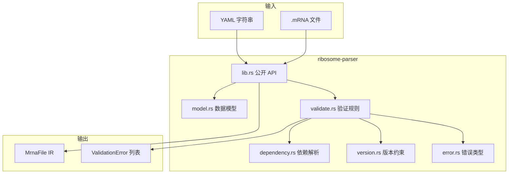

# ribosome-parser 设计文档

## 概述

`ribosome-parser` 是 Ribosome 构建系统的 mRNA YAML 解析与严格校验 crate。它将声明式构建描述文件反序列化为内部 IR（`MrnaFile`），并在反序列化后执行语义验证，为 `ribosome-cli`、`ribosome-deps` 等上层组件提供统一输入。

**范围（Sprint 1）**：解析 + 验证；不执行构建脚本、不下载源码、不验证 GPG 签名内容。

---

## 整体架构



### 模块职责

| 模块 | 职责 |
|---|---|
| `lib.rs` | `parse_mrna`、`parse_mrna_file`、`validate_mrna`、`collect_validation_issues` |
| `model.rs` | Serde 数据模型（YAML → Rust struct） |
| `dependency.rs` | 解析 `pkg >= 1.0` 依赖字符串为 `DependencySpec` |
| `version.rs` | `Version` 解析与 `VersionConstraint` 比较 |
| `validate.rs` | 严格验证规则（字段路径、Error/Warning） |
| `error.rs` | `ParserError`、`ValidationIssue`、`Severity` |

---

## 公开 API

```rust
/// 从 YAML 字符串解析并验证；失败返回 ParserError
pub fn parse_mrna(content: &str) -> Result<MrnaFile, ParserError>;

/// 从文件读取并解析验证
pub fn parse_mrna_file(path: &Path) -> Result<MrnaFile, ParserError>;

/// 仅验证已反序列化的 MrnaFile；有 Error 级问题时返回 Err
pub fn validate_mrna(mrna: &MrnaFile) -> Result<(), ParserError>;

/// 收集所有验证问题（含 Warning）
pub fn collect_validation_issues(mrna: &MrnaFile) -> Vec<ValidationIssue>;

/// 仅返回 Warning 级问题
pub fn validate_warnings(mrna: &MrnaFile) -> Vec<ValidationIssue>;
```

**解析流程**：

1. `serde_yaml::from_str` → `MrnaFile`（语法/结构错误 → `ParserError::YamlSyntax`）
2. `collect_validation_issues` → 过滤 `Severity::Error` → 非空则 `ParserError::Validation`

---

## 数据模型

### MrnaFile（顶层）

| Rust 字段 | YAML 键 | 类型 | 必需 |
|---|---|---|---|
| `api_version` | `api-version` | `u32` | 是 |
| `name` | `name` | `String` | 是 |
| `version` | `version` | `String` | 是 |
| `release` | `release` | `u32` | 是 |
| `description` | `description` | `String` | 是 |
| `homepage` | `homepage` | `Option<String>` | 否 |
| `license` | `license` | `String` | 是 |
| `maintainer` | `maintainer` | `Option<String>` | 否 |
| `tags` | `tags` | `Option<Vec<String>>` | 否 |
| `depends` | `depends` | `Option<Depends>` | 否 |
| `features` | `features` | `Option<Features>` | 否 |
| `sources` | `sources` | `Vec<Source>` | 是 |
| `patches` | `patches` | `Option<Vec<PatchItem>>` | 否 |
| `build` | `build` | `Option<Build>` | 否 |
| `post_install` | `post-install` | `Option<String>` | 否 |
| `post_remove` | `post-remove` | `Option<String>` | 否 |
| `outputs` | `outputs` | `Option<Outputs>` | 否 |

### Source

| 字段 | YAML 键 | 类型 |
|---|---|---|
| `url` | `url` | `String` |
| `hash` | `hash` | `Option<String>` |
| `signature` | `signature` | `Option<String>` |
| `key_id` | `key-id` | `Option<String>` |

### Depends

| 字段 | 类型 | 说明 |
|---|---|---|
| `build` | `Option<Vec<String>>` | 构建时依赖（验证阶段解析为 `DependencySpec`） |
| `runtime` | `Option<Vec<String>>` | 运行时依赖 |
| `check` | `Option<Vec<String>>` | 测试时依赖 |

### DependencySpec（验证期解析，非 Serde 直接字段）

```rust
pub struct DependencySpec {
    pub name: String,
    pub constraint: Option<VersionConstraint>,
}
```

### Version / VersionConstraint

```rust
pub struct Version {
    pub major: u64,
    pub minor: u64,
    pub patch: u64,
    pub rest: String,  // 预发布/构建元数据等尾部
}

pub enum VersionConstraint {
    GreaterOrEqual(Version),
    LessThan(Version),
    Equal(Version),
    GreaterThan(Version),
}
```

### Features / FeatureOption

```rust
pub struct Features {
    pub default: Vec<String>,
    pub options: HashMap<String, FeatureOption>,
}

pub struct FeatureOption {
    pub description: String,
    pub depends: Option<Vec<String>>,
    pub cflags: Option<String>,
}
```

### Outputs / OutputEntry

```rust
pub struct Outputs {
    pub entries: HashMap<String, OutputEntry>,
}

pub struct OutputEntry {
    pub description: String,
    pub files: Option<Vec<String>>,
}
```

### PatchItem

```rust
pub enum PatchItem {
    Simple(String),
    Conditional {
        name: String,
        condition: Option<String>,
        severity: Option<String>,
    },
}
```

YAML 支持：

```yaml
patches:
  - fix.patch
  - aarch64.patch:
      condition: 'arch == "aarch64"'
```

### Build

| 字段 | 必需（验证） |
|---|---|
| `prepare` | 否 |
| `compile` | 否 |
| `check` | 否 |
| `install` | **是**（`build` 块存在时） |

---

## 验证规则清单

| ID | 字段路径 | 级别 | 检查逻辑 |
|---|---|---|---|
| V01 | `api-version` | Error | 必须等于 `1` |
| V02 | `name` | Error | 非空；匹配 kebab-case `^[a-z][a-z0-9]*(-[a-z0-9]+)*$` |
| V03 | `version` | Error | 非空 |
| V04 | `release` | Error | `>= 1` |
| V05 | `description` | Error | 非空 |
| V06 | `license` | Warning | SPDX 标识符基本格式（`spdx` crate 或子集） |
| V07 | `sources` | Error | `len >= 1` |
| V08 | `sources[i].url` | Error | `http`/`https`/`ftp` scheme |
| V09 | `sources[i].hash` | Error | 若存在：匹配 `^sha256:[0-9a-fA-F]{64}$` |
| V10 | `sources[i].signature` | Error | 若存在：仅 `gpg` 或 `minisign` |
| V11 | `build.install` | Error | `build` 存在时 `install` 必须非空 |
| V12 | `depends.*[i]` | Error | 可解析为 `DependencySpec` |
| V13 | `depends` | Error | 包名不得等于当前 `name`（自引用） |
| V14 | `features.default[*]` | Error | 每个名称必须在 `features.options` 中 |
| V15 | `features.options.*.depends` | Error | 依赖字符串格式同 V12 |
| V16 | `outputs` | Warning | 若存在：建议包含 `main` 键 |
| V17 | `outputs.*.files[*]` | Warning | glob 基本语法（无未闭合 `*` 等） |
| V18 | `patches[i]` | Warning | 条件表达式非空（若 Conditional） |

---

## 错误类型体系

```rust
pub enum ParserError {
    YamlSyntax { source: serde_yaml::Error },
    Validation { issues: Vec<ValidationIssue> },
    Io { source: std::io::Error },
}

pub struct ValidationIssue {
    pub field: String,      // e.g. "sources[0].hash"
    pub message: String,
    pub severity: Severity,
}

pub enum Severity {
    Error,
    Warning,
}
```

`Display` 实现示例：`sources[0].hash: invalid sha256 format (expected sha256: + 64 hex digits)`

---

## 版本约束解析

### 文法（BNF）

```
dependency     ::= package_name [ whitespace constraint ]
constraint     ::= operator whitespace version_string
operator       ::= ">=" | "<=" | "<" | ">" | "="
package_name   ::= kebab-case identifier
version_string ::= non-empty, parsed by Version::parse
```

### Version::parse 规则

1. 按 `.` 分割，至少 1 段
2. 前三段解析为 `major`、`minor`、`patch`（缺省补 0）
3. 第四段及以后保留在 `rest`（如 `1.0.0-rc1`）

### 比较

按 `(major, minor, patch)` 字典序比较；`rest` 暂不参与排序（Sprint 1 足够）。

---

## 依赖字符串解析

实现：`dependency::parse_dependency_spec(input: &str) -> Result<DependencySpec, String>`

算法：

1. `trim` 输入
2. 用正则匹配尾部约束：`^(?P<name>[a-z][a-z0-9-]*)\s*(?P<op>>=|<=|>|<|=)\s*(?P<ver>.+)$`
3. 若无匹配且整体为合法包名 → 无约束
4. 否则解析 `ver` 为 `Version`，构造 `VersionConstraint`

---

## Features / Outputs / Patches 反序列化

- **Features**：标准 struct + `HashMap` for `options`
- **Outputs**：`#[serde(transparent)]` 包装 `HashMap<String, OutputEntry>`
- **Patches**：自定义 `Deserialize for PatchItem`，支持字符串或单键 map

---

## 测试策略

### 单元测试（crate 内 `#[cfg(test)]`）

| 模块 | 覆盖 |
|---|---|
| `version` | 解析、比较、边界版本 |
| `dependency` | 六种约束格式 + 非法输入 |
| `validate` | 每条 V01–V18 至少一个正/反例 |
| `lib` | 端到端 YAML fixture |

### 集成测试（`tests/`）

- `tests/fixtures/valid/*.yaml` — 应 `parse_mrna` 成功
- `tests/fixtures/invalid/*.yaml` — 应返回预期字段错误
- `tests/nucleus_smoke.rs` — 10 个 nucleus mRNA 全部通过

### 覆盖率目标

`ribosome-parser` 行覆盖率 > 80%（`cargo llvm-cov` 或 `cargo tarpaulin`，CI 可选）。

---

## 解析流程 Walkthrough（zlib 示例）

**输入**（节选）：

```yaml
api-version: 1
name: zlib
version: 1.3.1
release: 1
description: Compression library
license: Zlib
sources:
  - url: https://zlib.net/zlib-1.3.1.tar.xz
    hash: sha256:16455bf0addbd0f1241910a512f7e7b72a7aff05932ad9a105eb061e9119bfe1
build:
  install: |
    make DESTDIR="$DESTDIR" install
```

**步骤**：

1. `serde_yaml::from_str` → `MrnaFile { api_version: 1, name: "zlib", ... }`
2. `validate_mrna`：
   - V01–V05 通过
   - V07–V09 检查 sources
   - V11 检查 `build.install` 存在
3. 返回 `Ok(mrna)`

**失败示例**：`hash: sha256:abc` → V09 在 `sources[0].hash` 报错。

---

## 依赖 crate

| crate | 用途 |
|---|---|
| `serde` / `serde_yaml` | 反序列化 |
| `thiserror` | 错误定义 |
| `regex` | kebab-case、hash、依赖解析 |
| `spdx` | SPDX 许可证校验（Warning） |

---

## 与上游组件接口

| 消费者 | 使用方式 |
|---|---|
| `ribosome-cli` | `ribosome check` 调用 `parse_mrna_file` |
| `ribosome-deps` | 读取 `MrnaFile.depends`，用 `parse_dependency_spec` 建图 |
| Sprint 2+ `ribosome-core` | 构建执行器消费 `MrnaFile.build` |

---

## 参考资料

- [mRNA 语法参考](../mRNA-reference.md)
- [系统架构](../architecture.md)
- [Sprint 1 包规格表](./sprint1-mrna-packages.md)
