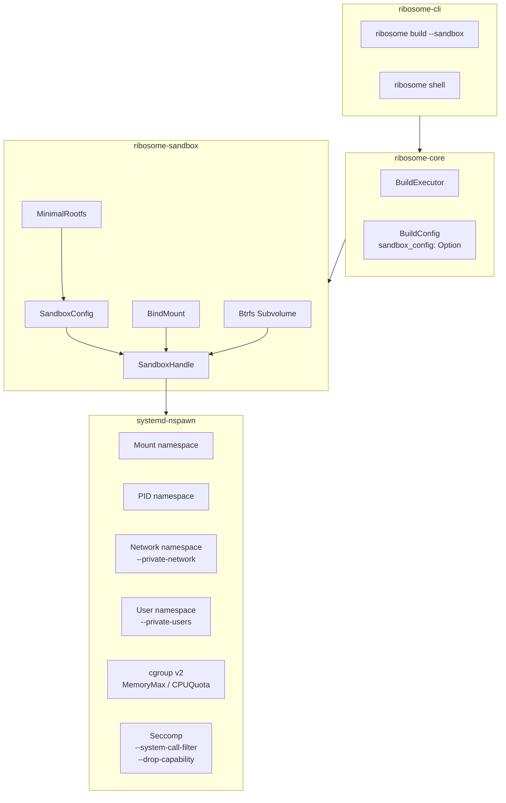

# ribosome-sandbox 设计文档

## 概述

`ribosome-sandbox` 是 Ribosome 构建系统的 membrane 构建沙箱 crate。它通过 `systemd-nspawn` 实现 Linux namespace/cgroup 隔离，为每个包的构建过程提供安全的执行环境，防止构建脚本污染宿主系统。

**范围（Sprint 3）**：基于 systemd-nspawn 的沙箱创建、执行、清理；集成到 BuildExecutor。

**Sprint 3 已实现**：
- User namespace 支持（`--private-users` + UID/GID 映射）
- Capability dropping（`--drop-capability`）
- System call 过滤（`--system-call-filter`）
- 自定义 rootfs 支持（`MinimalRootfs` + `RootfsSpec`）
- Btrfs subvolume 构建目录（快速创建/清理）

**后续迭代**：
- 最小 rootfs 自动创建脚本（从 .prot 包安装）
- seccomp 自定义 BPF 规则（如需更精细控制）

---

## 整体架构



### 模块职责

| 模块 | 职责 |
|------|------|
| `lib.rs` | 公开 API 导出、crate 级文档 |
| `config.rs` | `SandboxConfig`、`BindMount` 类型定义与 Builder 模式 |
| `sandbox.rs` | `SandboxHandle` 核心实现：create / run_phase / destroy |
| `rootfs.rs` | `MinimalRootfs` 最小根文件系统管理 |
| `btrfs.rs` | Btrfs subvolume 检测与操作 |
| `error.rs` | `SandboxError` 错误类型定义 |

---

## 公开 API

### SandboxConfig

```rust
pub struct SandboxConfig {
    pub rootfs: PathBuf,                          // 容器根文件系统
    pub network_isolation: bool,                  // 网络隔离
    pub memory_limit: Option<String>,             // 内存限制
    pub cpu_quota: Option<String>,                // CPU 配额
    pub bind_mounts: Vec<BindMount>,              // 绑定挂载列表
    pub env_vars: Vec<(String, String)>,          // 注入的环境变量
    pub working_dir: PathBuf,                     // 沙箱内工作目录
    pub user_namespace: bool,                     // User namespace 启用
    pub uid_map: Option<String>,                  // UID 映射
    pub gid_map: Option<String>,                  // GID 映射
    pub drop_capabilities: Vec<String>,           // 要丢弃的能力
    pub syscall_filter: Vec<String>,              // 系统调用过滤规则
}
```

Builder 模式方法：

```rust
SandboxConfig::new_for_build(build_base)
    .with_network_isolation(true)
    .with_memory_limit("8G")
    .with_cpu_quota("50%")
    .with_env("DESTDIR", "/srv/pkg")
    .with_user_namespace(true)
    .with_uid_map("0:1000:1")
    .with_gid_map("0:1000:1")
    .with_drop_capability("CAP_SYS_PTRACE")
    .with_syscall_filter("~ptrace")
```

### BindMount

```rust
pub struct BindMount {
    pub host_path: PathBuf,
    pub sandbox_path: PathBuf,
    pub writable: bool,
}
```

### SandboxHandle

```rust
pub struct SandboxHandle { ... }

impl SandboxHandle {
    pub fn new(build_base: PathBuf, config: SandboxConfig) -> Self;
    pub fn create(&self) -> Result<()>;       // Btrfs subvolume 自动检测
    pub fn run_phase(&self, script: &str) -> Result<PhaseOutput>;
    pub fn destroy(&self) -> Result<()>;      // Btrfs subvolume 快速清理
}
```

### MinimalRootfs

```rust
pub struct MinimalRootfs { ... }

impl MinimalRootfs {
    pub fn new(path: PathBuf) -> Self;
    pub fn create(&self) -> Result<()>;
    pub fn populate_from_host(&self, tools: &[&str]) -> Result<PopulateReport>;
    pub fn verify(&self) -> Result<VerifyReport>;
    pub fn remove(&self) -> Result<()>;
}
```

---

## systemd-nspawn 集成

### nspawn 命令模板

```bash
systemd-nspawn \
    --directory=<rootfs> \
    --quiet \
    --chdir=/srv/build \
    --bind=<build_base>/src:/srv/src \
    --bind=<build_base>/build:/srv/build \
    --bind=<build_base>/pkg:/srv/pkg:rw \
    [--private-network] \
    [--private-users] \
    [--private-users-uid=0:1000:1] \
    [--private-users-gid=0:1000:1] \
    [--drop-capability=CAP_SYS_PTRACE,CAP_SYS_ADMIN] \
    [--system-call-filter=~ptrace] \
    [--property=MemoryMax=8G] \
    [--property=CPUQuota=50%] \
    --setenv=DESTDIR=/srv/pkg \
    --setenv=SRCDIR=/srv/src \
    --setenv=BUILDDIR=/srv/build \
    --setenv=NPROC=16 \
    --setenv=ARCH=x86_64 \
    --setenv=PREFIX=/usr \
    -- /bin/bash -e -c "<script>"
```

### 隔离能力与 nspawn 参数映射

| 隔离能力 | nspawn 参数 | 当前状态 | 说明 |
|----------|------------|---------|------|
| Mount namespace | `--directory` + `--bind` | 已实现 | 构建目录独立挂载 |
| PID namespace | 默认开启 | 已实现 | 构建进程与宿主隔离 |
| Network namespace | `--private-network` | 已实现 | 可选离线构建模式 |
| cgroup 内存限制 | `--property=MemoryMax` | 已实现 | 防止 OOM 影响宿主 |
| cgroup CPU 限制 | `--property=CPUQuota` | 已实现 | 防止 CPU 饥饿 |
| User namespace | `--private-users` | **已实现** | 非 root 构建支持 |
| Capability dropping | `--drop-capability` | **已实现** | 丢弃危险能力 |
| System call 过滤 | `--system-call-filter` | **已实现** | 限制系统调用 |
| 自定义 rootfs | `--directory=<path>` | **已实现** | 隔离的构建文件系统 |
| Btrfs subvolume | 自动检测 | **已实现** | 快速创建/清理构建目录 |
| seccomp 自定义 BPF | 自定义规则 | 后续迭代 | 更精细的 syscall 白名单 |

---

## CLI 用法

```bash
# 普通构建（无沙箱）
ribosome build nucleus/core/bash/5.2.37.mRNA

# 沙箱构建
ribosome build --sandbox nucleus/core/gcc/14.2.0.mRNA

# 离线沙箱构建（自动启用沙箱）
ribosome build --no-network nucleus/core/gcc/14.2.0.mRNA

# 带内存限制的沙箱构建
ribosome build --sandbox --memory-limit 8G nucleus/core/gcc/14.2.0.mRNA

# User namespace 非特权构建
ribosome build --user-namespace --uid-map "0:1000:1" --gid-map "0:1000:1" nucleus/core/gcc/14.2.0.mRNA

# 丢弃危险能力 + 系统调用过滤
ribosome build --sandbox --drop-capabilities "CAP_SYS_PTRACE,CAP_SYS_ADMIN" --syscall-filter "~ptrace" nucleus/core/gcc/14.2.0.mRNA

# 使用自定义 rootfs
ribosome build --sandbox --rootfs /var/ribosome/rootfs-minimal nucleus/core/gcc/14.2.0.mRNA

# 全特性沙箱构建
ribosome build \
    --sandbox --no-network --memory-limit 8G \
    --user-namespace --drop-capabilities "CAP_SYS_PTRACE" \
    --syscall-filter "~ptrace" \
    --rootfs /var/ribosome/rootfs-minimal \
    nucleus/core/gcc/14.2.0.mRNA

# 进入构建沙箱调试
ribosome shell gcc-14.2.0
```

---

## 安全设计

### 已实现

- **Mount namespace**：构建脚本只能访问 bind mount 的目录
- **PID namespace**：构建进程无法看到或影响宿主进程
- **Network namespace**：`--no-network` 模式下完全禁用网络访问
- **cgroup 资源限制**：防止构建耗尽宿主内存和 CPU
- **只读挂载**：src 和 build 目录默认只读，只有 pkg 目录可写
- **User namespace**：`--user-namespace` 支持非特权构建，UID/GID 映射
- **Capability dropping**：`--drop-capabilities` 丢弃危险能力
- **System call 过滤**：`--syscall-filter` 限制系统调用
- **自定义 rootfs**：`--rootfs` 使用独立的根文件系统
- **Btrfs subvolume**：自动检测，快速创建/清理

### 后续迭代

- **seccomp 自定义 BPF**：更精细的 syscall 白名单
- **最小 rootfs 自动构建**：从 .prot 包自动安装

---

## 测试策略

### 单元测试（32 个）

sandbox 模块（17 个）覆盖：配置默认值、bind mount 参数、nspawn 命令构建、网络隔离、内存限制、环境变量、User namespace（默认/启用/UID映射）、交互命令继承、capability 丢弃、syscall 过滤、seccomp 默认关闭、组合隔离特性、目录创建和幂等性。

btrfs 模块（7 个）覆盖：Btrfs 检测、subvolume 检测、普通目录判断、构建目录创建/幂等/删除、不存在目录处理。

rootfs 模块（8 个）覆盖：目录结构创建、幂等创建、必要文件生成、空 rootfs 验证、完整 rootfs 验证、rootfs 删除、二进制查找成功/失败。

### 集成测试

```bash
# 在有 systemd-nspawn 的环境中手动运行
sudo cargo test -p ribosome-core -- --ignored
```

---

## 参考资料

- [systemd-nspawn 官方文档](https://www.freedesktop.org/software/systemd/man/latest/systemd-nspawn.html)
- [Arch Linux devtools](https://gitlab.archlinux.org/archlinux/devtools)：Arch Linux 的构建沙箱实践
- [LFS 13.0 systemd 版](https://www.linuxfromscratch.org/lfs/view/stable-systemd/)
