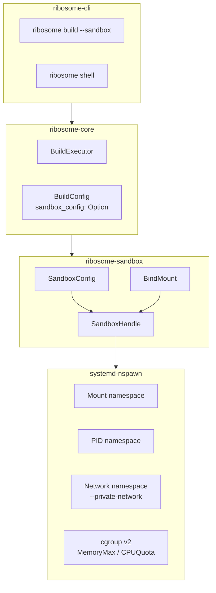
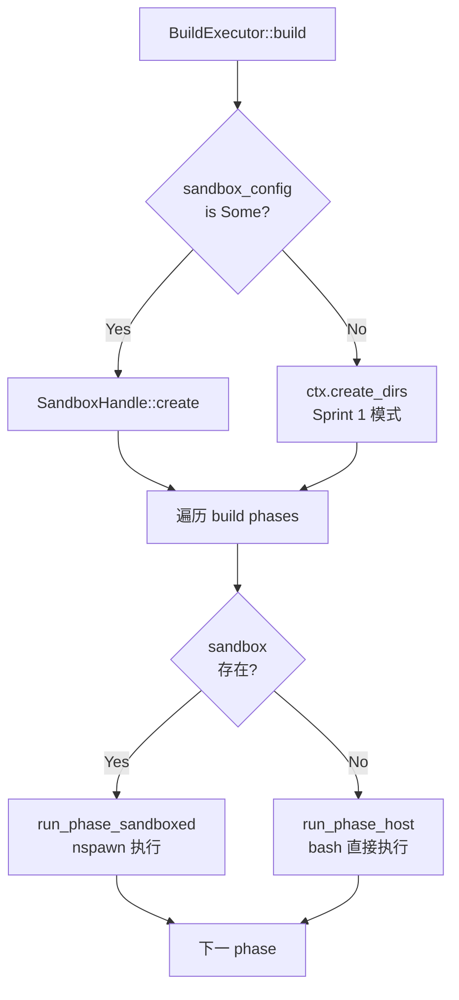

# ribosome-sandbox 设计文档

## 概述

`ribosome-sandbox` 是 Ribosome 构建系统的 membrane 构建沙箱 crate。它通过 `systemd-nspawn` 实现 Linux namespace/cgroup 隔离，为每个包的构建过程提供安全的执行环境，防止构建脚本污染宿主系统。

**范围（Sprint 3）**：基于 systemd-nspawn 的沙箱创建、执行、清理；集成到 BuildExecutor。

**后续迭代**：自定义最小 rootfs、seccomp 过滤、Btrfs subvolume 构建、User namespace 非 root 构建。

---

## 整体架构



### 模块职责

| 模块 | 职责 |
|------|------|
| `lib.rs` | 公开 API 导出、crate 级文档 |
| `config.rs` | `SandboxConfig`、`BindMount` 类型定义与 Builder 模式 |
| `sandbox.rs` | `SandboxHandle` 核心实现：create / run_phase / destroy |
| `error.rs` | `SandboxError` 错误类型定义 |

---

## 公开 API

### SandboxConfig

```rust
pub struct SandboxConfig {
    pub rootfs: PathBuf,              // 容器根文件系统（默认 "/"）
    pub network_isolation: bool,      // 网络隔离
    pub memory_limit: Option<String>, // 内存限制（如 "8G"）
    pub cpu_quota: Option<String>,    // CPU 配额（如 "50%"）
    pub bind_mounts: Vec<BindMount>,  // 绑定挂载列表
    pub env_vars: Vec<(String, String)>, // 注入的环境变量
    pub working_dir: PathBuf,         // 沙箱内工作目录
}
```

Builder 模式方法：

```rust
SandboxConfig::new_for_build(build_base)
    .with_network_isolation(true)
    .with_memory_limit("8G")
    .with_cpu_quota("50%")
    .with_env("DESTDIR", "/srv/pkg")
```

### BindMount

```rust
pub struct BindMount {
    pub host_path: PathBuf,
    pub sandbox_path: PathBuf,
    pub writable: bool,
}
```

转为 nspawn 参数格式：`--bind=<host_path>:<sandbox_path>` 或 `--bind=<host_path>:<sandbox_path>:rw`

### SandboxHandle

```rust
pub struct SandboxHandle { ... }

impl SandboxHandle {
    pub fn new(build_base: PathBuf, config: SandboxConfig) -> Self;
    pub fn create(&self) -> Result<()>;
    pub fn run_phase(&self, script: &str) -> Result<PhaseOutput>;
    pub fn destroy(&self) -> Result<()>;
}
```

### PhaseOutput

```rust
pub struct PhaseOutput {
    pub success: bool,
    pub stdout: String,
    pub stderr: String,
    pub exit_code: Option<i32>,
}
```

---

## systemd-nspawn 集成

### nspawn 命令模板

```bash
systemd-nspawn \
    --directory=<rootfs> \
    --quiet \
    --chdir=/srv/build \
    --bind=<build_base>/src:/srv/src \
    --bind=<build_base>/build:/srv/build \
    --bind=<build_base>/pkg:/srv/pkg:rw \
    [--private-network] \
    [--property=MemoryMax=8G] \
    [--property=CPUQuota=50%] \
    --setenv=DESTDIR=/srv/pkg \
    --setenv=SRCDIR=/srv/src \
    --setenv=BUILDDIR=/srv/build \
    --setenv=NPROC=16 \
    --setenv=ARCH=x86_64 \
    --setenv=PREFIX=/usr \
    -- /bin/bash -e -c "<script>"
```

### 隔离能力与 nspawn 参数映射

| 隔离能力 | nspawn 参数 | 当前状态 | 说明 |
|----------|------------|---------|------|
| Mount namespace | `--directory` + `--bind` | 已实现 | 构建目录独立挂载 |
| PID namespace | 默认开启 | 已实现 | 构建进程与宿主隔离 |
| Network namespace | `--private-network` | 已实现 | 可选离线构建模式 |
| cgroup 内存限制 | `--property=MemoryMax` | 已实现 | 防止 OOM 影响宿主 |
| cgroup CPU 限制 | `--property=CPUQuota` | 已实现 | 防止 CPU 饥饿 |
| User namespace | `--private-users` | 后续迭代 | 非 root 构建支持 |
| seccomp 过滤 | 自定义 BPF | 后续迭代 | 限制系统调用 |
| Btrfs subvolume | `--bind=` + subvol | 后续迭代 | 快速清理构建目录 |

### 为什么选择 systemd-nspawn

根据项目决策原则 **简洁性 > 安全性 > 性能 > 体验**：

| 维度 | systemd-nspawn | 直接 Linux namespace API |
|------|---------------|------------------------|
| 简洁性 | 高（一个命令完成所有隔离） | 低（需要 clone/unshare/pivot_root 等） |
| 安全性 | 高（systemd 团队维护） | 中（自己实现容易出错） |
| 性能 | 中（有容器 overhead） | 高（无中间层） |
| 维护成本 | 低 | 高 |

nspawn 是架构文档明确指定的方案，与 LFS 13.0 systemd 版天然契合。

---

## 沙箱内路径映射

构建目录在沙箱内有固定映射：

```
宿主路径                              沙箱内路径        用途
<build_root>/<pkg>-<ver>/src    →    /srv/src      源码
<build_root>/<pkg>-<ver>/build  →    /srv/build    构建
<build_root>/<pkg>-<ver>/pkg    →    /srv/pkg      安装目标
```

因此沙箱内的环境变量使用 `/srv/...` 路径：

| 变量 | 沙箱内值 | 说明 |
|------|---------|------|
| `DESTDIR` | `/srv/pkg` | 安装目标 |
| `SRCDIR` | `/srv/src` | 源码目录 |
| `BUILDDIR` | `/srv/build` | 构建目录 |
| `NPROC` | 宿主检测 | CPU 核心数 |
| `ARCH` | `x86_64` | 目标架构 |
| `PREFIX` | `/usr` | 安装前缀 |

---

## 与 BuildExecutor 的集成

### 执行路径选择



### 向后兼容

- `BuildConfig::new()` 默认 `sandbox_config: None`，行为与 Sprint 1 完全一致
- 只有用户显式传入 `--sandbox` 或 `--no-network` 时才启用沙箱
- 现有测试全部不受影响

---

## CLI 用法

```bash
# 普通构建（无沙箱，Sprint 1 模式）
ribosome build nucleus/core/bash/5.2.37.mRNA

# 沙箱构建
ribosome build --sandbox nucleus/core/gcc/14.2.0.mRNA

# 离线沙箱构建（自动启用沙箱）
ribosome build --no-network nucleus/core/gcc/14.2.0.mRNA

# 带内存限制的沙箱构建
ribosome build --sandbox --memory-limit 8G nucleus/core/gcc/14.2.0.mRNA

# 进入构建沙箱调试
ribosome shell gcc-14.2.0
ribosome shell /var/ribosome/build/gcc-14.2.0
```

---

## 安全设计

### 已实现

- **Mount namespace**：构建脚本只能访问 bind mount 的目录，无法访问宿主其他路径
- **PID namespace**：构建进程无法看到或影响宿主进程
- **Network namespace**：`--no-network` 模式下完全禁用网络访问
- **cgroup 资源限制**：防止构建耗尽宿主内存和 CPU
- **只读挂载**：src 和 build 目录默认只读，只有 pkg 目录可写

### 后续迭代

- **seccomp BPF 过滤**：白名单模式限制系统调用
- **最小 rootfs**：使用精简的构建专用根文件系统而非宿主根
- **User namespace**：支持非 root 用户构建
- **Btrfs subvolume**：利用快照实现构建目录的快速创建和清理

---

## 测试策略

### 单元测试（7 个，已实现）

| 测试 | 验证内容 |
|------|---------|
| `test_sandbox_config_default_values` | 默认配置正确性 |
| `test_bind_mount_nspawn_arg_readonly` | 只读 bind mount 参数格式 |
| `test_bind_mount_nspawn_arg_writable` | 可写 bind mount 参数格式 |
| `test_nspawn_command_construction` | nspawn 命令参数完整性 |
| `test_nspawn_network_isolation_flag` | 网络隔离标志 |
| `test_nspawn_memory_limit` | 内存限制参数 |
| `test_nspawn_env_vars` | 环境变量注入 |

### 集成测试（需要 root/nspawn，手动运行）

```bash
# 在有 systemd-nspawn 的环境中手动运行
sudo cargo test -p ribosome-core -- --ignored
```

测试用 `#[ignore]` 标记，CI 中自动跳过。

---

## 参考资料

- [systemd-nspawn 官方文档](https://www.freedesktop.org/software/systemd/man/latest/systemd-nspawn.html)
- [Arch Linux devtools](https://gitlab.archlinux.org/archlinux/devtools)：Arch Linux 的构建沙箱实践
- [LFS 13.0 systemd 版](https://www.linuxfromscratch.org/lfs/view/stable-systemd/)
